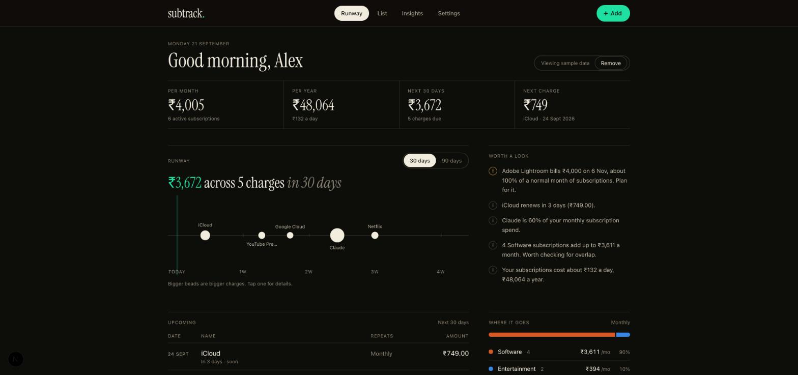
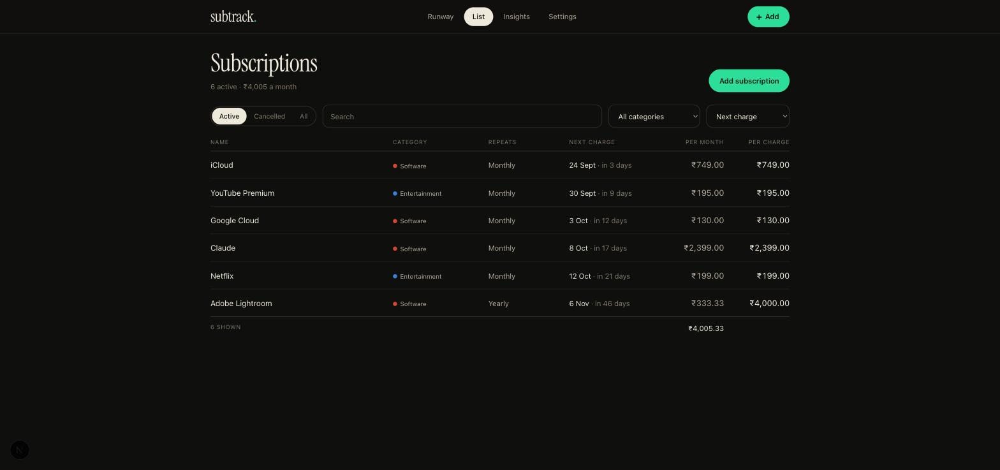
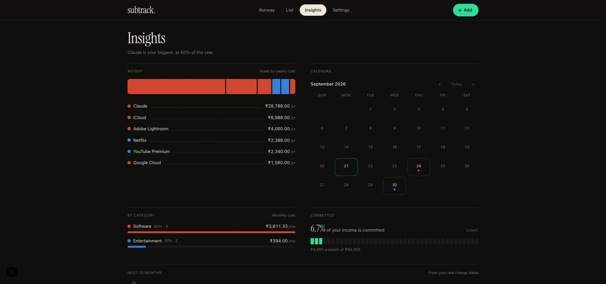
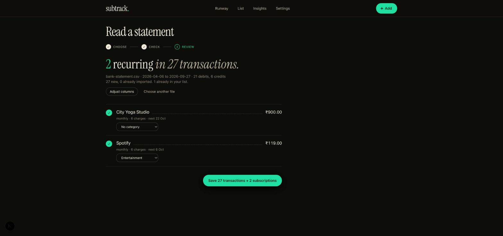
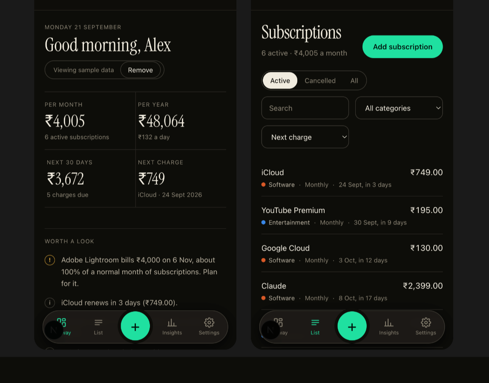
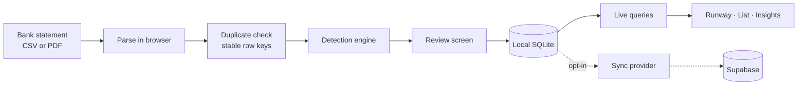

# Subtrack

A private, offline-first subscription tracker. It finds your recurring payments in bank statements, shows what is about to leave your account and when, and points out what is worth acting on. Everything lives on your device unless you opt in to sync.



## Contents

- [Features](#features)
- [Quick start](#quick-start)
- [Configuration](#configuration)
- [Data model](#data-model)
- [How it works](#how-it-works)
- [Cloud sync](#cloud-sync-optional)
- [Backup and restore](#backup-and-restore)
- [Design system](#design-system)
- [Development](#development)
- [Troubleshooting](#troubleshooting)
- [Roadmap](#roadmap) · [Known limitations](#known-limitations)

## Features

**Runway (home).** A KPI strip (per month, per year and per day, next 30 days, next charge), a 30 or 90 day timeline where every charge is a bead sized by its amount, an aligned table of upcoming charges, a category split, an income-committed gauge, and **Worth a look** insights.

**Subscriptions.** A sortable, filterable table (status, category, search) with per-month and per-charge cost and a totals row. One edit sheet handles edit, cancel, resume and delete.



**Insights.** Yearly weight by subscription, category breakdown, a 12-month schedule built from real charge dates, a renewal calendar that opens on your next renewal, income share, and money saved by cancelling.



**Import.** Drag and drop a bank statement (CSV or PDF). Columns are mapped automatically and you are only asked when detection is unsure. Re-imports and overlapping statements never create duplicates, and nothing is saved until you review it.



**Settings.** Profile (name, currency, income), sample data, backup download and restore, delete everything, and cloud sync.

**Phone friendly.** A bottom dock with a raised add button, single-column layouts and thumb-sized controls.



**Sample data.** On the very first launch of an empty app, six example subscriptions are added (iCloud, YouTube Premium, Google Cloud, Claude, Netflix, Adobe Lightroom) so the dashboard has something to show. They are tagged, can be removed from the home banner or Settings, and never return once removed or replaced by your own data.

### Worth a look

Plain-language observations computed from your subscriptions, most useful first:

| Insight | When it appears |
| --- | --- |
| Large non-monthly charge ahead | A charge on a cycle of 3 months or more is due within 90 days and is at least 25% of a normal month of subscriptions. |
| Renewal coming up | A subscription renews within 3 days (at most two are shown). |
| One subscription dominates | The biggest is at least 30% of monthly spend, with at least three subscriptions tracked. |
| Category crowding | A category with two or more subscriptions makes up at least 25% of monthly spend. |
| Cost per day | Always shown: yearly cost divided by 365. |

## Quick start

Requires Node 18 or newer and npm.

```bash
npm install
npm run dev          # http://localhost:3000
```

If port 3000 is taken, run `npx next dev -p 3111`. The app needs a **secure context** for its local database, so use `localhost` (or HTTPS), not a LAN IP address.

On first launch you are asked for your name and main currency, and the sample data is added. To use your own data, open **Import**, or **Add** subscriptions by hand, then remove the samples.

| Script | Purpose |
| --- | --- |
| `npm run dev` | Development server |
| `npm run build` / `npm start` | Production build and server |
| `npm test` | Unit tests (Vitest) |
| `npm run test:watch` | Tests in watch mode |
| `npm run typecheck` | `tsc --noEmit` |
| `npm run lint` | ESLint |

## Configuration

The default build needs **no configuration**. Environment variables only enable cloud sync:

| Variable | Purpose |
| --- | --- |
| `NEXT_PUBLIC_SUPABASE_URL` | Your Supabase project URL |
| `NEXT_PUBLIC_SUPABASE_ANON_KEY` | Supabase anon (public) key. Row-level security is what protects the data. |
| `NEXT_PUBLIC_POWERSYNC_URL` | Your PowerSync instance URL |

Keep them in `.env.local` (gitignored). When any is missing, the sync option is hidden and the app stays local-only. See [docs/supabase-setup.md](docs/supabase-setup.md) for the backend.

**PWA:** a Serwist service worker and web manifest make the app installable and available offline. The service worker is **disabled in development** and only active in production builds (`npm run build && npm start`).

## Data model

Data lives in a local SQLite database (wa-sqlite on OPFS, through PowerSync). The schema is in [`lib/db/schema.ts`](lib/db/schema.ts). Every table has an implicit text `id` (a UUID).

**`subscriptions`**

| Column | Type | Notes |
| --- | --- | --- |
| `name` | text | Display name, for example "Netflix" |
| `amount` | real | Amount **per charge**, in major units (199.00) |
| `currency` | text | ISO code |
| `interval_count`, `interval_unit` | integer, text | Repeat cycle. Unit is `day`, `week`, `month` or `year`. Quarterly is 3 months. |
| `last_charge_date`, `next_charge_date` | text | `YYYY-MM-DD`. A stale next date rolls forward automatically. |
| `active` | integer | 1 active, 0 cancelled |
| `category` | text | Entertainment, Software, Utilities, Finance, Shopping, Food & Drink or Other |
| `source` | text | `manual`, `statement_import` or `sample` |
| `confidence` | real | 0 to 1, from detection (1 for manual) |
| `is_variable` | integer | 1 when the amount changes from charge to charge |
| `tags`, `created_at`, `updated_at` | | `created_at` and `updated_at` are epoch milliseconds |

**`profiles`**: `name`, `monthly_income`, `currency`, `last_csv_upload`, `created_at`, `updated_at`. One row.

**`transactions`**: imported bank rows, kept so detection can be re-run without re-importing. `date` (ISO), `description`, `amount_minor` (**integer minor units**, negative is a debit), `currency`, `merchant`, `category`, `import_id`, `dedupe_key`, `created_at`. Indexed by date and by dedupe key.

**`settings`** (device-local, never synced or backed up): a key/value table holding `schema_version` and the `sample_seeded` first-run flag.

Additive schema changes are applied by PowerSync from the schema definition. One-off data transforms are versioned migrations in [`lib/db/migrations.ts`](lib/db/migrations.ts).

## How it works



### Project layout

```
app/                   Routes: / (Runway), /subscriptions, /insights, /import, /settings
components/
  shell/               App shell (top bar and mobile dock), add flow, first-run welcome
  home/  runway/       Dashboard parts, runway timeline, income gauge
  charts/              Schedule chart, bar lists, renewal calendar
  subscriptions/       Edit sheet, subscription form, category tag
  import/              Import flow and column-mapping step
  ui/                  Button, Card and Section, Field, Dialog, Badge, PageHeader
lib/
  db/                  Schema, migrations, backup format, sample data, first-run seeding
  detection/           Subscription detection engine (pure, no I/O)
  import/              CSV and PDF parsing, dates and amounts, duplicate keys, persistence
  subscriptions/       Schedule math, totals and forecast, insights, persistence
  sync/                SyncProvider seam (no-op by default) and the Supabase provider
  hooks/               useLiveQuery, useSubscriptions, useProfile
types/                 Integer-money helpers
docs/                  Screenshots and the backend setup guide
__tests__/             Unit tests for the pure logic
```

Business logic is pure and lives under `lib/`; components stay thin. Money is handled in **integer minor units** wherever it is computed (see [Known limitations](#known-limitations)).

### Detection engine (`lib/detection`)

`detectSubscriptions(transactions, { asOf?, merchants? })` runs one pipeline:

1. **Filter.** Drop invalid dates, zero amounts, and debits that are loans, EMIs, salary, interest, cash or self transfers.
2. **Normalize.** Known-merchant rules first (for example anything containing "netflix" becomes Netflix); otherwise strip payment rails, UPI handles and reference numbers and keep the first meaningful words.
3. **Group** by merchant, then **cancel refunded debits**: a credit of the same amount within 7 days removes the debit. Identical same-day rows collapse to one.
4. **Find the frequency** from the gaps between charges. Tolerances: weekly 6 to 8 days, biweekly 13 to 15, monthly 27 to 34, quarterly 84 to 98, yearly 350 to 380. At least 60% of the gaps must agree.
5. **Check the amounts.** One price level means stable; a single step (219 to 749) is a **price change**; constantly moving amounts from an unknown merchant are treated as bills and dropped.
6. **Grade.** `confirmed` is 3 or more regular charges, `probable` is 2, `possible` is a single charge from a known subscription merchant. Confidence is a deterministic 0 to 1 score.
7. **Lapse check.** No charge for more than two cycles marks it inactive with no next date. A single charge is never called lapsed, since its cadence is unknown.

Known merchants and noise words are plain data in [`lib/detection/merchants.ts`](lib/detection/merchants.ts). Callers can pass extra rules that take priority.

### Import (`lib/import`)

**CSV.** Finds the header row even below account details. Recognizes date, description, debit and credit columns, a single signed amount, or an amount plus a Dr/Cr column. Credit-card exports where positive means a purchase are supported by a checkbox. Day-first versus month-first dates are inferred from the data (a value like `25/03` proves day-first) and you are asked only when every date is ambiguous. Handles a BOM and other delimiters.

**PDF.** Text is read with pdf.js and grouped into visual lines. Debit versus credit is decided from how the **running balance** moves, in either oldest-first or newest-first statements. `Dr` and `Cr` suffixes are trusted. When a row cannot be checked, the direction is guessed from the description and a warning says how many rows. Password-protected and scanned PDFs get a clear message; for scanned statements use a CSV export.

**Amounts and dates.** Understands `Rs.`, `INR`, `$`, `EUR`, thousands separators in both `1,234.56` and `1.234,56` style (including lakh grouping), `(199.00)` and trailing minus as negative, and dates such as `2025-01-05`, `05/01/2025`, `5 Jan 2025` and `Jan 5, 2025`.

**Duplicates.** Each row gets a stable key from date, amount and a normalized description. Genuinely identical same-day rows get an occurrence suffix, so two coffees stay two rows and still line up on re-import. Detection runs over all stored transactions plus the new ones, so it improves as you import more months.

## Cloud sync (optional)

Sync is off until you turn it on, and the app never needs it. It exists so the same data can follow you across devices.

- **Sign-in:** Supabase magic link (email only, no passwords). Sync requires a signed-in user; there is no anonymous mode.
- **Isolation:** every synced table carries a `user_id`, and row-level security limits each user to their own rows.
- **Transport:** PowerSync keeps the local database and Supabase in step in both directions. Changes made offline are queued and uploaded when you reconnect.
- **Provider seam:** the app talks to a `SyncProvider` interface ([`lib/sync/types.ts`](lib/sync/types.ts)). The default provider does nothing; the Supabase provider is loaded on demand, so local-only users never download backend code.
- **Safe uploads:** transient errors are retried; permanently invalid rows are dropped so one bad row cannot block the queue.
- **Turning it off** stops syncing and keeps all local data. **Turning it on** uploads existing local data the first time.
- **Status:** off, connecting, syncing, synced or error.

To use it, set the three [environment variables](#configuration) and sign in from **Settings**. To create the backend (tables, row-level security policies, PowerSync sync rules), follow **[docs/supabase-setup.md](docs/supabase-setup.md)**.

## Backup and restore

**Settings → Download backup** writes a JSON file; **Restore** reads one back. This works with or without cloud sync.

```json
{
  "format": "subtrack-backup",
  "version": 1,
  "exportedAt": "2026-09-21T09:00:00.000Z",
  "tables": {
    "subscriptions": [{ "id": "…", "name": "Netflix", "amount": 199, "…": "…" }],
    "profiles": [],
    "transactions": []
  }
}
```

- **Merge** upserts rows by `id` and leaves other rows alone. **Replace** clears your data first. Both run in one transaction.
- Restore validates untrusted files: it checks the format tag, rejects backups from a newer version, requires every row to have a string `id`, and only accepts column names made of lowercase letters, digits and underscores (they are used in SQL).

## Design system

A single dark theme called **Runway**. Tokens live in [`app/globals.css`](app/globals.css).

- **Surfaces:** warm near-black canvas (`#0d0c0a`), with cards and inputs one step lighter. Structure comes from hairline rules and type, not boxes.
- **Signal color:** aurora green (`#1fe0a0`) marks what is next and what is actionable. Status colors (warning, danger) are reserved for state and always come with text or an icon.
- **Type:** Geist for the UI, Geist Mono for dates and labels, Instrument Serif for headline figures. Numerals in columns use tabular figures.
- **Chart colors:** category colors follow a fixed order (Entertainment, Software, Utilities, Finance, Shopping, Food & Drink, Other) and were validated for lightness, chroma, colorblind separation and contrast on the dark surface. A category keeps its color everywhere. Charts have text equivalents (value labels and a "view as table" toggle).
- **Motion** respects the reduced-motion setting.

## Development

- **Stack:** Next.js 16 (App Router, Turbopack), React 19, TypeScript, Tailwind CSS v4, `@powersync/web` with `@journeyapps/wa-sqlite`, PapaParse, pdf.js, Recharts, Serwist, Vitest.
- **Tests:** `npm test` covers the pure logic: detection, parsers, schedules, totals, insights, backup format, migrations and money helpers. The UI and cloud sync are verified manually; there are no component or end-to-end tests yet.
- **Before committing:** run `npm run typecheck`, `npm run lint` and `npm test`. All three should pass.
- **Adding a merchant:** add a rule to `lib/detection/merchants.ts` and a test case in `__tests__/detection.test.ts`.
- **Changing the schema:** edit `lib/db/schema.ts`. If existing rows need transforming, add a migration to `lib/db/migrations.ts` and a test. Mirror the change in the Supabase tables if you use sync.
- **Commit style:** `#<number> <short summary>`.
- **License:** none has been specified yet.

## Troubleshooting

| Problem | What to check |
| --- | --- |
| The app shows an error about the database or never loads data | The local database needs a secure context. Use `http://localhost:<port>` or HTTPS, and a browser with OPFS support (current Chrome, Edge, Safari or Firefox). |
| "Port 3000 is in use" | Start on another port: `npx next dev -p 3111`. Each port and host is a separate browser origin with its own data. |
| My data disappeared after changing the address | Data is per browser origin (`localhost:3000` and `localhost:3111` are different). Use one address, and keep a backup. |
| A PDF imports nothing | Scanned or image-only PDFs have no text to read. Export a CSV from your bank instead. Password-protected PDFs must be unlocked first. |
| Dates look swapped after import | When every date is ambiguous the app asks you to choose day-first or month-first on the **Check** step. Use **Adjust columns** to change it. |
| Amounts import with the wrong sign | On the **Check** step, tick "Positive amounts are purchases" for credit-card style exports, or pick the Dr/Cr column. |
| A subscription is not detected | It needs at least two regular charges (or one from a known subscription merchant). Import more months, or add it by hand. |
| The installed app looks out of date | The service worker only runs in production builds. Reload once after a new deploy so the update takes effect. |
| Sync problems | See the troubleshooting table in [docs/supabase-setup.md](docs/supabase-setup.md). |

## Roadmap

- Offline verification of the installed PWA
- Accessibility pass (contrast, keyboard, chart labelling)
- Real-device testing on phones
- Convert subscription amounts to integer minor units

## Known limitations

- **Currencies are not converted.** Totals use your main currency; subscriptions in other currencies are excluded and the app says so.
- **Subscription amounts are floating point** in the database, while transactions use integer minor units. Money is converted at the edges.
- **The merchant list is a starter set** (a mix of global and Indian services), not exhaustive. Unknown merchants are still detected from their charge pattern.
- **PDF parsing** was built against typical layouts and synthetic fixtures. Unusual statement formats may need a CSV export or a column-mapping fix.
- **Sync conflicts** follow last-write-wins per row, with no field-level merging. Restore's "merge" mode overwrites rows that share an id.
- **Device coverage:** the UI has been checked in desktop Chrome and a phone-width frame, not on physical devices.
