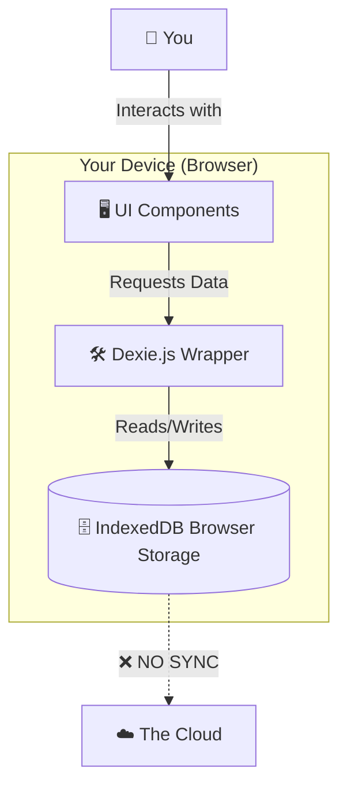

# 🧠 Subtrack: Inside Out & Deep Dive

Welcome to the **"Pro" Guide** for Subtrack. This document is designed to take you from "I know what this app does" to "I understand exactly how every byte moves in this application." 

We will explore the **Philosophy**, **Architecture**, **Data Structures**, and **Algorithmic Logic** that power this offline-first finance tracker.

> **💡 Who is this guide for?**  
> Whether you are a senior engineer or a curious user who just wants to key into how their data is handled, this guide is for you. We explain the *concepts* first, then the *code*.

---

## 📚 Glossary: Speak the Language
Before we dive in, let's define some terms we'll use often:

*   **Client-Side**: Everything happens on *your* device (phone/laptop). Nothing is sent to a remote computer.
*   **PWA (Progressive Web App)**: A website that can be installed on your phone and works offline, just like an App Store app.
*   **IndexedDB**: A database that lives inside your web browser. Think of it as a localized Excel file that only this specific website can read.
*   **Wrapper**: A piece of code that makes a difficult tool easier to use. (Like putting a steering wheel on a car engine).
*   **Parsing**: Reading a messy file (like a CSV) and turning it into structured data the computer can understand.

---

## 🏗 The Philosophy: "Offline First" & "Local Only"

### Why this approach?
Most finance apps require you to link your bank account via Plaid/Yodlee, essentially giving a third-party server access to your financial life. **Subtrack flips this model.**

1.  **Privacy**: Your data *never* leaves your device. There is no backend server. No API that logs your transactions.
2.  **Speed**: Reading from a local database (IndexedDB) is near-instantaneous (0-2ms latency) compared to fetching from a cloud server (100-500ms).
3.  **Resilience**: The app works 100% without an internet connection.

### The Trade-off
Since there is no cloud, **there is no sync**. If you use Subtrack on your phone, you don't see that data on your laptop. This is a deliberate design choice for privacy and simplicity.

---

## 🛠 Tech Stack: The "Why" behind the "What"

### 1. Next.js 16 (App Router)
*   **Why**: Even though we are a client-side app, Next.js provides the best **build tooling** and **routing** in the ecosystem.
*   **Usage**: We use the App Router (`/app`) for structure. Note that almost all our heavy lifting happens in `use client` components because we need access to the browser's `window` and `IndexedDB`.

### 2. Dexie.js & IndexedDB (The Database)
#### Why IndexedDB? (vs Component State or LocalStorage)
*   **LocalStorage is Sync**: LocalStorage is blocking. If you have 10,000 transactions, reading them freezes the UI for a split second. IndexedDB is **Asynchronous**, meaning the UI stays buttery smooth while data loads.
*   **Storage Limits**: LocalStorage is capped at ~5MB. IndexedDB can store **hundreds of gigabytes** (depending on disk space).
*   **Querying**: LocalStorage is just Key-Value. You can't say "Give me all transactions between Jan 1 and Jan 31". You have to load *everything* and filter in memory. IndexedDB allows **Indexes**, so we can query *only* the data we need.

#### Why Dexie? (vs Alternatives)
1.  **vs. `localForage`**: localForage is great for simple Key-Value storage (like a better localStorage). But Subtrack needs **complex queries** (e.g., "Find all transactions where Amount < 0 AND Date is last month"). localForage can't do this efficiently without loading *all* data into memory first. Dexie uses IndexedDB's native indices to filter *before* loading.
2.  **vs. `idb`**: `idb` is a tiny wrapper around IndexedDB (built by Google). It's fantastic but very low-level. You still have to manage transaction scopes and cursor loops manually. Dexie abstracts this into a fluent API (`db.friends.where('age').above(25).toArray()`), saving us hundreds of lines of boilerplate.
3.  **vs. `PouchDB`**: PouchDB is designed for syncing with CouchDB. It's powerful but **heavy**. Since we are "Local Only" and don't need sync conflicts resolution, PouchDB adds unnecessary bloat size to our app bundle. Dexie is lightweight and focused purely on the local browser experience.


### 3. PapaParse (The CSV Parser)
*   **Why PapaParse? (vs Alternatives)**
    1.  **vs. `csv-parser` / `fast-csv`**: These are primarily designed for **Node.js** streams. Getting them to work specifically in the browser often requires polyfills (Buffer, Stream) that bloat your bundle. PapaParse is **Browser-First**.
    2.  **vs. `String.split(',')`**: The naive approach breaks on quoted fields (e.g., `"Netflix, Inc."`).
    3.  **vs. `d3-dsv`**: D3 is great if you are already using D3 for charts. But we use `Recharts`. importing D3 just for CSV parsing is overkill.
    4.  **The Killer Feature**: **Sniffing**. PapaParse automatically detects if the CSV uses commas (`,`), semicolons (`;`), or tabs (`\t`) as delimiters. Bank exports are notoriously inconsistent, so this auto-detection prevents user errors.


### 4. Tailwind CSS 4
*   **Why**: Speed of iteration. We don't want to switch between `.css` and `.tsx` files.
*   **Design System**: We use a `globals.css` file for some complex generic styles (like the blob background animations) but keep layout logic in the components.

---

## 🧩 Architecture: The "Serverless" Reality

In a traditional app, your data travels around the world. In Subtrack, it stays in your pocket.

### Visualizing the Flow


### The Data Model (`db/schema.ts`)
We have four core entities:
1.  **Transactions**: The raw data. 
    *   *Key*: `id` (UUID).
    *   *Indexes*: `date` (for sorting), `category` (for charts).
2.  **Subscriptions**: Derived data. These are *detected* from strict patterns in Transactions.
3.  **Rules**: Logic for auto-categorization. "If description contains 'Uber', set category to 'Transport'".
4.  **Profile**: Simple metadata (Name, Income) for calculating "Percent Spent".

---

## 🧠 The Brain: Algorithms & Logic

The real "magic" happens in the `/utils` folder. These are **Pure Functions**—they take data in, and spit processed data out, without side effects.

### 1. The CSV Import Logic (`utils/csvImport.ts`)
*   **Challenge**: Every bank's CSV is different. Some have a "Date" column, some "Post Date". Some use negative numbers for spending, others use a "Debit" column.
*   **Solution**: `Mapping`.
    *   We parse the raw CSV using **PapaParse** (fastest JS CSV parser).
    *   We ask the user to "map" their columns to our internal schema.
    *   **De-duplication**: This is critical. If you upload the same CSV twice, we don't want double transactions. 
    *   *Logic*: We assume a transaction is a duplicate if `Date`, `Description`, and `Amount` ALL match an existing entry.

### 2. The Subscription Detector (`utils/subscriptionDetection.ts`)
This is the "AI" of the app. It uses **Statistical Heuristics** (fancy words for "educated guesses").

#### The Logic Flow
```mermaid
flowchart TD
    A[Start: All Transactions] --> B[Group by Merchant Name]
    B --> C{More than 2 payments?}
    C -- No --> D[Ignore]
    C -- Yes --> E[Calculate Days Between Payments]
    E --> F{Avg interval approx 30 days?}
    F -- Yes --> G[✅ Mark as Monthly Sub]
    F -- No --> H{Avg interval approx 365 days?}
    H -- Yes --> I[✅ Mark as Yearly Sub]
    H -- No --> J[Ignore (Irregular Spending)]
```

#### Step-by-Step "Human" Explanation
1.  **Normalization**: The code looks at "NETFLIX.COM* 123" and "NETFLIX.COM* 456". It strips the numbers to realize they are both just "netflix".
2.  **Grouping**: It gathers every "netflix" transaction into a pile.
3.  **The "Pulse" Check**: It measures the heartbeat of payments.
    *   If the heart beats every ~30 days, it's a monthly sub.
    *   **Tolerance**: We allow a "wobble" of 20%. If you pay on the 1st one month and the 3rd the next, that's okay. It's still a sub.
    *   *Why 20%?* Weekends and bank holidays can shift payments by a day or two. A strict check would fail real-world data.

### 3. Forecasting (`utils/forecast.ts`)
We keep it simple to avoid "overfitting".
*   **Formula**: `Next Month Expense = (Avg Monthly Expense) + (Active Subscriptions)`
*   We use a simple average of previous months to predict variable spending (food, fuel) and add the strict fixed costs (Rent, Netflix) on top.

---

## 🎨 UI/UX Patterns

### The "Dashboard" Loading Pattern (`app/page.tsx`)
Because IndexedDB is asynchronous, we can't render server-side.
1.  **Initial Render**: The page loads with empty states (`[]`).
2.  **`useEffect` Hook**: Fires deeply after mount.
3.  **`Promise.all`**: We fetch Transactions, Subscriptions, and Rules in parallel.
    ```typescript
    const [txs, subs, rules] = await Promise.all([ ... ]);
    ```
4.  **State Update**: React re-renders with the data.

### Charts (Recharts)
We use `recharts` because it is SVG-based and highly customizable.
*   **Data Transformation**: The raw DB data isn't chart-ready. We use `useMemo` hooks to transform `Transaction[]` into `[{ name: 'Food', value: 500 }]` efficiently, ensuring we don't re-calculate loops on every render.

---

## 🎓 How to extend this app (Your "Pro" Challenge)
If you want to master this codebase, try these challenges:

1.  **Add "Tags"**: Modify `schema.ts` to add `tags: string[]` to Transactions. Update the UI to filter by tags.
2.  **Multi-Currency**: Add a `currency` field. You'll need to fetch exchange rates or let users set a fixed rate.
3.  **Backup/Restore**: Since data is local, if you clear browser cache, it's gone. Build a "Export JSON" and "Import JSON" feature in Settings.

---

## 🔮 Level Up: How to Implement "Global Sync"
You asked: *"What if I want to see my data on both my phone and laptop?"* 
Because we are "Local Only", this is the hardest problem to solve. Here are the 3 ways to do it, ranked by difficulty.

### Level 1: The "Manual" Sync (Easy)
*   **How**: Build an "Export to JSON" button in Settings.
*   **Flow**: 
    1. Phone: Click "Export". Save `backup.json` to iCloud Drive / Google Drive.
    2. Laptop: Open Subtrack. Click "Import". Select `backup.json`.
*   **Pros**: Zero server costs. 100% private.
*   **Cons**: Annoying to do every day.

### Level 2: The "E2E Encrypted Relay" (Medium)
*   **Concept**: Use a dumb server (like Firebase/Supabase) just to *pass* data, not read it.
*   **Flow**:
    1. **Encryption**: On your device, encrypt the JSON with a password (AES-GCM).
    2. **Upload**: Send the *encrypted blob* to the cloud. The cloud server sees only gibberish.
    3. **Download**: Other device downloads the blob and decrypts it with the same password.
*   **Pros**: Automatic syncing. High privacy (server can't read data).
*   **Cons**: You need to host a small backend.

### Level 3: The "Local-First" Sync Engine (Hard / Expert)
*   **Concept**: Use CRDTs (Conflict-Free Replicated Data Types).
*   **Tech**: **PowerSync**, **ElectricSQL**, or **Replicache**.
*   **How it works**: 
    *   These engines sit *between* your frontend and IndexedDB.
    *   They record every change (mutation) as a tiny event.
    *   When online, they sync these events to a server.
    *   If you change "Food" to "Groceries" on your phone, and "Food" to "Dining" on your laptop at the exact same second, CRDTs mathematically merge them without losing data.
*   **Pros**: The "Holy Grail" of sync. Real-time, conflict-free, offline-ready.
*   **Cons**: Extremely complex to set up. Overkill for a personal project.

### 3. Level 3 (Details): Implementing "PowerSync"
If you are serious about this, here is the roadmap to reach Valhalla. We will use **Supabase** (Postgres) and **PowerSync**.

#### Step 1: The Cloud Database (Supabase)
1.  Create a Supabase project (it gives you a Postgres DB).
2.  Run the SQL to create your tables (`transactions`, `subscriptions`, `profiles`) in Postgres.
    *   *Note*: IndexedDB is NoSQL, Postgres is SQL. You need to map them.

#### Step 2: The Middleware (PowerSync)
1.  Connect PowerSync to Supabase.
2.  Define **Sync Rules** in PowerSync dashboard (e.g., `SELECT * FROM transactions WHERE user_id = request.user_id`).
    *   *Why?* You don't want User A downloading User B's data.

#### Step 3: The Frontend Rewrite (The Hard Part)
You must RIP OUT **Dexie.js**.
*   **Install**: `@powersync/web`, `@powersync/react`.
*   **Setup**:
    ```typescript
    // Instead of db/index.ts (Dexie)
    export const db = new PowerSyncDatabase({
      schema: AppSchema,
      database: new WebSqlOpenFactory({ dbFilename: 'subtrack.db' }),
    });
    ```
*   **Hooks**: Replace `db.transactions.toArray()` with:
    ```typescript
    const { data: transactions } = useQuery('SELECT * FROM transactions');
    ```
    *   *Magic*: `useQuery` automatically re-renders when *remote* data changes!

#### Step 4: Authentication
You can't have sync without Users.
1.  Add Supabase Auth (Google Login).
2.  When user logs in, pass the JWT token to PowerSync.
3.  PowerSync uses this token to fetch *only* that user's data.

**Result**: You edit on your phone -> Saves to local SQLite -> Syncs to PowerSync -> Syncs to Postgres -> Syncs to Dashboard on Laptop. All in <100ms.

---


---

## 🧐 Nuances & "Gotchas" (The Fine Print)

### 1. "Where is my data exactly?"
It lives in a hidden folder in your browser called `IndexedDB`.
*   **Danger Zone**: If you clear your "Cookies and Site Data" or "Browsing History", **you might wipe your database.**
*   *Protection*: This is why a "Backup to JSON" feature is key (see Pro Challenges).

### 2. Mobile vs Desktop
Since there is no cloud sync, your phone and laptop are two separate universes.
*   If you add Netflix on your phone, your laptop won't know about it.
*   *Why?* Encryption and syncing require a backend server, which costs money and introduces privacy risks. We chose **Privacy > Convenience**.

### 3. The "Uncategorized" Problem
The auto-categorizer is only as smart as the rules you give it.
*   *Default*: Everything starts as "Uncategorized".
*   *Learning*: When you edit a transaction and create a rule, you are "teaching" the local brain.

---

This architecture was chosen to give you **maximum power** with **minimum overhead**. You own the code, you own the data, and you understand the logic.

